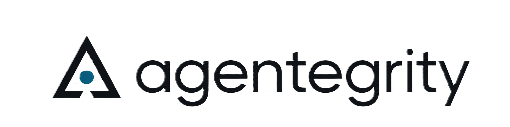

<p align="center">
  
</p>

<p align="center">
  
[](https://opensource.org/licenses/Apache-2.0)
[](https://www.python.org/downloads/)
[](pyproject.toml)
[](spec/SPECIFICATION.md)

</p>
---
# Agentegrity Framework

**Building AI agents capable of securing themselves.**

Every existing AI security tool builds protection that humans apply to agents from the outside. Guardrails filter inputs. Runtime monitors watch outputs. Policy engines enforce rules. These are necessary, and Agentegrity does not replace them. Agentegrity addresses a different question: how do you measure whether the agent itself has the structural integrity to remain coherent when those external controls cannot reach inside its decision process?

Agentegrity (agent + integrity) is the discipline of building AI agents that can defend themselves, stabilize themselves, and recover themselves — and then verifying that they actually can. This repository provides the open specification, the reference architecture, and a Python implementation for that verification.

---

## Why This Matters Now

Frontier model labs ship better base models on a regular cadence. Each new release reduces the rate at which the underlying model produces unsafe outputs in isolated benchmarks. This is real progress, and it does not solve the agent security problem.

Enterprises do not deploy base models. They deploy compositions: a base model wrapped in system prompts, augmented with retrieval over private data, given access to tools that touch customer systems, equipped with persistent memory, orchestrated through planning loops, and embedded in environments that produce inputs the model was never trained against. Every capability gain in the underlying model enables more ambitious compositions with more attack surface. The composition layer is where security failures occur, and the composition layer is not what the model labs are improving.

Agentegrity is positioned at the composition layer specifically. Its measurements are about whether the assembled agent — not the underlying model — has the structural properties required to maintain integrity under adversarial pressure, across deployment contexts, and over time.

---

## The Three Self-Securing Capabilities

A self-securing agent maintains three properties simultaneously. Each property is a capability the agent has, not a control imposed on it from outside. The Agentegrity Framework defines how to verify each one.

| Capability | What The Agent Does | What This Prevents |
|---|---|---|
| **Self-Defense** | Maintains coherent reasoning under adversarial pressure across all input channels | Goal hijacking, prompt injection, indirect injection via retrieved content, tool output poisoning |
| **Self-Stability** | Monitors its own behavioral drift against an established baseline and detects internal state corruption | Slow-drift attacks, memory poisoning, gradual goal redirection, identity erosion |
| **Self-Recovery** | Detects when its integrity has been compromised and restores itself to a known-good state | Persistent compromise, undetected lateral movement, state pollution across sessions |

v0.6.0 ships verification for all three capabilities (self-defense via the adversarial layer, self-stability via the cortical layer with optional LLM-backed semantic checks, self-recovery via the recovery layer with persistable checkpoint round-trip) across **eleven zero-config framework adapters** — five in Python (**Claude Agent SDK**, **LangChain / LangGraph**, **OpenAI Agents SDK**, **CrewAI**, **Google ADK**) and six in TypeScript (the same five, plus **Vercel AI SDK** which has no Python equivalent). All eleven share the `SessionExporter` extension point that lets any subscriber (including the commercial `agentegrity-pro` dashboard) receive live session data without touching the agent, and the same evaluator pipeline and attestation chain — a 2-3 line instrumentation on any of these frameworks produces the same signed audit trail.

---

## The Four Layers

The framework implements verification through four architectural layers. Each layer addresses a different dimension of integrity. Together they form a complete envelope around the agent.

```
┌─────────────────────────────────────────────┐
│            RECOVERY LAYER                   │
│   Compromise detection · Continuity ·       │
│   Sustained-degradation tracking            │
├─────────────────────────────────────────────┤
│           GOVERNANCE LAYER                  │
│   Policy enforcement · Human oversight ·    │
│   Compliance mapping · Audit trails         │
├─────────────────────────────────────────────┤
│            CORTICAL LAYER                   │
│   Reasoning consistency · Memory checks ·   │
│   Behavioral baselines · Drift detection    │
├─────────────────────────────────────────────┤
│           ADVERSARIAL LAYER                 │
│   Attack surface mapping · Threat           │
│   detection · Coherence scoring             │
└─────────────────────────────────────────────┘
```

The **Adversarial Layer** verifies self-defense by mapping the agent's attack surface and detecting threats across input channels. The **Cortical Layer** verifies self-stability by monitoring reasoning consistency, memory integrity, and behavioral drift from baseline. The **Governance Layer** enforces organizational policy and produces audit trails so verification results have a place to live in compliance workflows. The **Recovery Layer** verifies self-recovery by tracking the attestation chain for continuity, watching score history for sustained degradation, and confirming the agent declares the recovery capabilities it claims (`state_restore`, `checkpoint`, `rollback`, `session_reset`).

---

## What This Library Does (and Does Not)

We believe in being explicit about what the library is and is not, because a security library that overpromises is worse than one that underdelivers.

**What it does.** It provides a Python implementation of the four-layer verification architecture defined in the [Agentegrity Specification](spec/SPECIFICATION.md). It computes integrity scores from real evaluation runs, generates cryptographically signed attestation records, builds tamper-evident attestation chains, and produces structured audit logs for governance workflows. It runs locally with zero required dependencies and never makes network calls to Cogensec or any other service. It ships with extension points for custom threat detectors, custom policy rules, and custom validators.

**What it does not do.** The adversarial layer ships a regex pattern taxonomy across six attack families (prompt_injection, jailbreak, role_confusion, system_prompt_extraction, data_exfiltration, prompt_obfuscation) — calibrated 1.000 TPR / 0.000 FPR on the in-repo synthetic suite, but **0.000 TPR on the InjecAgent benchmark** (N=2,108) because action-oriented injections embedded in tool responses don't match the regex patterns. Closing that gap requires either an embedding-similarity check or an LLM-backed semantic classifier — both planned for the next release. The cortical layer uses Jensen-Shannon distance with Laplace smoothing for drift detection (replaces the older asymmetric KL approximation) and structural memory-provenance inspection. v0.2.0 introduced optional LLM-backed cortical checks (`pip install agentegrity[llm]`) that use Claude for semantic reasoning-chain validation, memory-provenance analysis, and drift classification; these run alongside the pattern-based checks and fail open on API errors. Production deployments should also register custom detectors with domain-specific logic. As of v0.6.0 the library ships eleven framework adapters — five in Python (Claude Agent SDK, LangChain / LangGraph, OpenAI Agents SDK, CrewAI, Google ADK) and six in TypeScript (the same five plus Vercel AI SDK). Adapters for Semantic Kernel, AutoGen, and AWS Bedrock Agents are on the post-0.6 roadmap.

**What it deliberately is not.** It is not a guardrail. It does not block agent actions on its own — when an action is blocked, that is the result of explicit governance policy, not inferred risk. It is not a runtime enforcement layer trying to compete with WAF-style products. It is not a hosted service. It is a measurement and verification library, and everything it does is in service of producing evidence that an agent has (or lacks) the structural properties of a self-securing system.

---

## Quick Start

### Installation

```bash
pip install "agentegrity[claude]"          # Claude Agent SDK
pip install "agentegrity[langchain]"       # LangChain + LangGraph
pip install "agentegrity[openai-agents]"   # OpenAI Agents SDK
pip install "agentegrity[crewai]"          # CrewAI
pip install "agentegrity[google-adk]"      # Google Agent Development Kit
```

Other extras: `[crypto]` (Ed25519 attestation signing), `[llm]` (LLM-backed cortical checks via the Anthropic API), `[all]` (everything).

### Instrument an existing Claude Agent SDK agent

Three lines of agentegrity, zero configuration. `hooks()` lazily builds a default adapter with a sensible `AgentProfile`, the full four-layer evaluator, and measure-only semantics (it never blocks tool calls).

```python
from claude_agent_sdk import ClaudeSDKClient, ClaudeAgentOptions
from agentegrity.claude import hooks, report

async with ClaudeSDKClient(options=ClaudeAgentOptions(hooks=hooks())) as sdk:
    await sdk.query("Summarize the latest LLM safety papers")
print(report())
```

`report()` returns the session summary — evaluation count, attestation chain length, whether the chain verifies, and enforcement mode. For a cryptographically signed audit trail, pair this with the `[crypto]` extra.

### Instrument LangChain / LangGraph, OpenAI Agents, CrewAI, or Google ADK

Same three-line shape for every supported framework:

```python
# LangChain or LangGraph (one adapter, both frameworks)
from agentegrity.langchain import instrument_chain, instrument_graph, report
chain = instrument_chain(my_chain); chain.invoke({"input": "..."}); print(report())

# OpenAI Agents SDK
from agents import Runner
from agentegrity.openai_agents import run_hooks, report
await Runner.run(agent, input="...", hooks=run_hooks()); print(report())

# CrewAI
from agentegrity.crewai import instrument, report
instrument(); crew.kickoff(); print(report())

# Google ADK
from agentegrity.google_adk import instrument, report
instrument(agent); print(report())
```

Every adapter uses the same default profile, evaluator, and attestation chain as the Claude path — pass `profile=`, `client=`, `enforce=True`, or `api_key=` to override.

Quick sanity check from the terminal:

```bash
python -m agentegrity          # version + installed adapters
python -m agentegrity doctor   # end-to-end self-check, prints composite score
```

### Export session data to a dashboard or external sink

Every adapter exposes `register_exporter(exporter)`. Implement three async methods — `on_session_start`, `on_event`, `on_session_end` — and every evaluated event streams to your exporter as JSON-ready dicts. Exporter exceptions are caught and logged so a broken sink can never break the agent.

```python
from agentegrity.langchain import register_exporter, instrument_graph

class PrintExporter:
    async def on_session_start(self, session_id, adapter_name, profile): ...
    async def on_event(self, session_id, event):
        print(event["event_type"], event["evaluation_result"])
    async def on_session_end(self, session_id, summary): ...

register_exporter(PrintExporter())
graph = instrument_graph(my_graph)
```

This is the integration point the commercial [**`agentegrity-pro`**](https://github.com/cogensec/agentegrity-pro) dashboard listens on. Deploy the pro backend with `docker compose up`, set `AGENTEGRITY_URL` and `AGENTEGRITY_TOKEN` on the agent, and the default adapter streams every session over the published exporter HTTP API — no extra package required.

### Non-Python agents (TypeScript / Bun / Node)

TypeScript agents get the same **2–3 line zero-config** DX as the Python adapters. Install the adapter that matches your framework; each one sets `AGENTEGRITY_URL` / `AGENTEGRITY_TOKEN` from env and streams events through any `SessionExporter` you register.

**Claude Agent SDK:**
```ts
import { query } from "@anthropic-ai/claude-agent-sdk";
import { hooks } from "@agentegrity/claude-sdk";
await query({ prompt: "hi", options: { hooks: hooks() } });
```

**LangChain JS:**
```ts
import { ChatAnthropic } from "@langchain/anthropic";
import { instrument } from "@agentegrity/langchain";
await new ChatAnthropic({ callbacks: [instrument()] }).invoke("hi");
```

**OpenAI Agents SDK:**
```ts
import { Agent, run } from "@openai/agents";
import { runHooks } from "@agentegrity/openai-agents";
await run(agent, "hi", { hooks: runHooks() });
```

**CrewAI JS:**
```ts
import { instrument } from "@agentegrity/crewai";
instrument().attach(crew.events);
```

**Google ADK:**
```ts
import { instrument } from "@agentegrity/google-adk";
const close = instrument(agent);
```

**Vercel AI SDK** (TypeScript-native — no Python equivalent):
```ts
import { streamText } from "ai";
import { instrument } from "@agentegrity/vercel-ai";
await streamText({ model, prompt: "hi", experimental_telemetry: instrument() });
```

Each adapter re-exports `report()`, `reset()`, and `registerExporter()` for the same flow you get in Python. The low-level `@agentegrity/client` reporter is still available for custom frameworks, and the wire format is published as JSON Schema (`schemas/exporter/`) and OpenAPI 3.1 (`schemas/openapi.yaml`). Drift between the Python `to_dict()` output and the schemas is caught in CI by `tests/test_schemas.py`.

### Evaluate an arbitrary agent profile

For agents outside the Claude SDK — or for one-off profile scoring — the high-level `AgentegrityClient` runs the full four-layer evaluation in four lines:

```python
from agentegrity import AgentegrityClient

client = AgentegrityClient()
score = client.evaluate(client.create_profile(name="my-agent"))
print(f"{score.composite:.3f}  ({score.action})")
```

### Runtime monitoring with attestation

For long-running agents, wrap actions with `@monitor.guard` to run pre- and post-execution checks and build a tamper-evident attestation chain:

```python
from agentegrity import IntegrityMonitor

monitor = IntegrityMonitor(
    profile=client.create_profile(name="my-agent"),
    evaluator=client.evaluator,
    threshold=0.70,
    enable_attestation=True,
)

@monitor.guard
async def agent_action(context=None):
    return await agent.execute(context)

result = await agent_action(context={"action": {"type": "tool_call"}})
print(f"Records: {len(monitor.attestation_chain)}")
print(f"Chain valid: {monitor.attestation_chain.verify_chain()}")
```

### Configuring the evaluator

When the defaults aren't enough — custom thresholds, custom layer weights, custom threat detectors — drop down to `IntegrityEvaluator` directly:

```python
from agentegrity import IntegrityEvaluator
from agentegrity.layers import AdversarialLayer, CorticalLayer, GovernanceLayer

evaluator = IntegrityEvaluator(
    layers=[
        AdversarialLayer(coherence_threshold=0.85),
        CorticalLayer(drift_tolerance=0.10),
        GovernanceLayer(policy_set="enterprise-default"),
    ]
)
```

See [`examples/`](examples/) for walkthroughs including custom threat detectors, custom policy rules, and the full explicit-config Claude adapter flow.

---

## Repository Structure

```
agentegrity-framework/
├── MANIFESTO.md                 # The Agentegrity Manifesto
├── README.md                    # You are here
├── LICENSE                      # Apache 2.0
├── pyproject.toml               # Package configuration
├── agentegrity-glossary.md      # Vocabulary of the discipline
│
├── spec/                        # Framework Specification
│   ├── SPECIFICATION.md         # Full technical specification
│   ├── properties/              # Property definitions
│   │   ├── adversarial-coherence.md
│   │   ├── environmental-portability.md
│   │   └── verifiable-assurance.md
│   └── layers/                  # Layer architecture
│       ├── adversarial-layer.md
│       ├── cortical-layer.md
│       └── governance-layer.md
│
├── src/agentegrity/             # Python Reference Implementation
│   ├── __init__.py
│   ├── __main__.py              # `python -m agentegrity` + doctor CLI
│   ├── claude.py                # Zero-config Claude Agent SDK surface
│   ├── langchain.py             # Zero-config LangChain + LangGraph surface
│   ├── openai_agents.py         # Zero-config OpenAI Agents SDK surface
│   ├── crewai.py                # Zero-config CrewAI surface
│   ├── google_adk.py            # Zero-config Google ADK surface
│   ├── core/                    # Core abstractions
│   │   ├── profile.py           # AgentProfile (+ .default() factory)
│   │   ├── evaluator.py         # IntegrityEvaluator, PropertyWeights
│   │   ├── attestation.py       # AttestationRecord, AttestationChain
│   │   └── monitor.py           # IntegrityMonitor with @guard decorator
│   ├── layers/                  # Layer implementations
│   │   ├── adversarial.py       # AdversarialLayer (self-defense)
│   │   ├── cortical.py          # CorticalLayer (self-stability)
│   │   ├── governance.py        # GovernanceLayer (policy + audit)
│   │   └── recovery.py          # RecoveryLayer (self-recovery)
│   ├── adapters/                # Framework integrations
│   │   ├── base.py              # _BaseAdapter + FrameworkAdapter Protocol
│   │   ├── claude.py            # ClaudeAdapter
│   │   ├── langchain.py         # LangChainAdapter (covers LangGraph)
│   │   ├── openai_agents.py     # OpenAIAgentsAdapter
│   │   ├── crewai.py            # CrewAIAdapter
│   │   └── google_adk.py        # GoogleADKAdapter
│   └── sdk/                     # High-level convenience wrapper
│       └── client.py            # AgentegrityClient
│
├── schemas/                     # Cross-language wire contract
│   ├── exporter/                # JSON Schema (Draft 2020-12)
│   │   ├── common.json          # Shared $defs (profile, event, score)
│   │   ├── session_start.json
│   │   ├── event.json
│   │   └── session_end.json
│   └── openapi.yaml             # OpenAPI 3.1 spec for exporter endpoints
│
├── clients/
│   └── typescript/              # @agentegrity/client — TS/Bun/Node reporter
│       ├── src/                 # AgentegrityReporter + types
│       ├── examples/            # basic.ts wiring example
│       ├── package.json
│       └── README.md
│
├── tests/                       # Test suite (145 tests, all passing)
│
└── examples/                    # Usage examples
    ├── claude_adapter.py
    ├── claude_adapter_advanced.py
    ├── langchain_adapter.py
    ├── openai_agents_adapter.py
    ├── crewai_adapter.py
    ├── google_adk_adapter.py
    ├── basic_evaluation.py
    ├── runtime_monitoring.py
    └── custom_validator.py
```

---

## Roadmap

**v0.1.0 — Initial release.** Three-layer architecture (adversarial / cortical / governance), pattern-based reference checks, cryptographic attestation, custom validator and policy extension points, three working examples. The recovery layer joined as a default fourth layer in v0.6.0.

**v0.2.0 — Claude Agent SDK, LLM-backed checks, and self-recovery.** First framework adapter targeting the Claude Agent SDK with five integration points (Harness, Tools, Sandbox, Session, Orchestration). Optional LLM-backed cortical checks using Claude for semantic analysis of reasoning chains, memory provenance, and behavioral drift. Recovery integrity layer for self-recovery verification. Async-first evaluator pipeline that runs independent layers in parallel.

**v0.2.1 — Developer experience.** Zero-config `agentegrity.claude` top-level module (`hooks()` / `report()` / `reset()` — three-line instrumentation with no setup), `AgentProfile.default()` factory, `python -m agentegrity` info + `doctor` self-check CLI.

**v0.3.0 — Multi-framework adapters.** Four new framework adapters joining Claude — **LangChain / LangGraph**, **OpenAI Agents SDK**, **CrewAI**, and **Google Agent Development Kit** — each with the same three-line instrumentation surface. A `_BaseAdapter` shared by all five implementations means new frameworks are mostly mechanical to add going forward.

**v0.4.0 — Exporter hook + cross-language contract.** OSS-side `SessionExporter` protocol + `register_exporter()` on every adapter. Session data (session_start, every evaluated event, session_end) streams as JSON-ready dicts to any subscribed exporter, fail-open so a broken sink never breaks the agent. The wire format is published as **JSON Schema** (`schemas/exporter/`) and **OpenAPI 3.1** (`schemas/openapi.yaml`); a first-party **TypeScript client** in `clients/typescript/` (`@agentegrity/client`) lets Bun / Node agents emit the same event stream. The commercial dashboard ships separately as `agentegrity-pro`.

**v0.5.0 — Six TypeScript framework adapters.** Mirror the five Python adapters (Claude Agent SDK, LangChain JS, OpenAI Agents SDK, CrewAI JS, Google ADK) as dedicated npm packages — `@agentegrity/claude-sdk`, `@agentegrity/langchain`, `@agentegrity/openai-agents`, `@agentegrity/crewai`, `@agentegrity/google-adk` — plus a TypeScript-native `@agentegrity/vercel-ai` adapter for the Vercel AI SDK via its OpenTelemetry tracer surface. Every package depends on a shared `createDefaultAdapter()` helper in `@agentegrity/client` and ships the same 2-3 line zero-config DX as Python. Release workflow publishes all seven packages in a matrix; `scripts/check-versions.ts` enforces version parity with `pyproject.toml`.

**v0.5.3 — Release & build polish.** Concrete version pins on TypeScript workspace deps (replacing `workspace:*`) so published packages install cleanly off‑registry, GitHub Actions bumped to checkout@v5 / setup-python@v6 / setup-node@v5, scoped push triggers + concurrency cancellation in CI, repo moved to the `cogensec` org, and an `AGENTEGRITY_OFFLINE` env var so test runs work without a reporter. Adds a Python `scripts/check_versions.py` mirroring the TypeScript one to keep `pyproject.toml`, `src/agentegrity/__init__.py`, and the README badge / claim lines from drifting apart again.

**v0.6.0 — Detection depth + recovery round-trip + conformance + benchmark (current).** The adversarial layer's substring match becomes a 21-pattern regex taxonomy across six attack families. The cortical layer's drift metric becomes Jensen-Shannon distance with Laplace smoothing and a `min_drift_samples` guard. `RecoveryLayer` gains a real `Checkpoint` Protocol with `InMemory` / `File` / `Sqlite` reference backends and a tested `snapshot()` ↔ `restore_to()` round-trip. The cortical layer gains a parallel `BaselineStore` Protocol so behavioural baselines survive process restarts. A cross-adapter conformance suite pins 9 invariants × 5 adapters. A detection benchmark harness (`pytest -m benchmark`) runs the synthetic suite plus loaders for InjecAgent / PINT / AgentDojo; numbers published in `STATUS.md`. Branch coverage gates land on Python (≥85%) and TypeScript (≥80% lines / 70% functions). The recovery layer is promoted to a first-class fourth default layer; `PropertyWeights` defaults rebalanced so RI gets 0.15 of the composite. Full migration notes in `CHANGELOG.md`.

**v0.6.0 — More adapters and compliance output (next).** Adapters for Semantic Kernel, AutoGen, AWS Bedrock Agents. Compliance report generation for EU AI Act, NIST AI RMF, and ISO 42001. Observability exporters (OpenTelemetry, Datadog).

**v1.0.0 — Stable API (when ready).** Declared stable when the public API has been unchanged for a full minor release cycle, when the library has production deployments at three or more external organizations, and when the framework has been cited in at least one peer-reviewed publication. v1.0.0 is not a date — it's a signal that adoption has happened beyond our direct influence.

---

## Documentation

| Document | Description |
|---|---|
| [Manifesto](MANIFESTO.md) | The founding statement of agentegrity as a discipline |
| [Specification](spec/SPECIFICATION.md) | Full technical specification (properties, layers, controls, scoring) |
| [Glossary](agentegrity-glossary.md) | Vocabulary of the discipline, defined precisely |
| [Adversarial Layer](spec/layers/adversarial-layer.md) | Self-defense verification architecture |
| [Cortical Layer](spec/layers/cortical-layer.md) | Self-stability verification architecture |
| [Governance Layer](spec/layers/governance-layer.md) | Policy enforcement and audit architecture |
| [Recovery Layer](spec/layers/recovery-layer.md) | Self-recovery verification architecture |

---

## Design Principles

1. **Self-securing capability is the goal. Verification is the methodology.** The framework exists because agents need to be able to secure themselves. The scoring system is how we prove they can. Without the underlying capability, the score is theater. Without the verification methodology, the capability is unprovable. Both are required.

2. **Composition layer, not model layer.** Better base models do not eliminate the need for agent-level verification. They make compositions more capable and therefore more dangerous when compromised. The framework is positioned at the composition layer specifically because that's the layer model improvements don't close.

3. **Defense-in-depth, not defense-in-replacement.** Guardrails, runtime monitors, and network controls remain essential. Agentegrity adds a layer that sits inside the agent's decision process where exogenous controls cannot reach. The two complement each other.

4. **Cryptographic, not observational.** "We monitored the agent and it looked fine" is not assurance. Attestation records produced by this library are signed, chained, and independently verifiable. Verification means you can prove what the agent's state was at a point in time, not just that someone watched it.

5. **Open standard, plural implementations.** The specification is open. The reference implementation is Apache 2.0. Other implementations are welcome from any vendor, any framework, any deployment context. The integrity of autonomous agents is too important to be proprietary, and a single-vendor standard isn't a standard.

6. **Honest about limitations.** Every claim the library makes is defensible in writing. When checks can't run, they say so. When the implementation is a pattern-based reference rather than semantic analysis, the README says so. The worst possible outcome for this project is a published benchmark showing that our claims are louder than our implementation. We avoid that outcome by being the first to name limitations.

---

## Contributing

We welcome contributions. See [CONTRIBUTING.md](CONTRIBUTING.md) for guidelines.

Priority areas for v0.4 and beyond:
- Additional framework adapters (Semantic Kernel, AutoGen, AWS Bedrock Agents, Agno)
- Minimal web dashboard for session visualization
- Compliance report generation (EU AI Act, NIST AI RMF, ISO 42001)
- Domain-specific validator libraries (healthcare, finance, embodied)
- Language ports (TypeScript, Go, Rust)
- Formal verification of layer interactions
- Cross-framework session merging (multiple adapters sharing one attestation chain)

---

## Citation

If you use the Agentegrity Framework in research or production, please cite:

```bibtex
@misc{agentegrity2026,
  title={The Agentegrity Framework: Building and Verifying Self-Securing Autonomous AI Agents},
  author={Cogensec Research},
  year={2026},
  url={https://github.com/cogensec/agentegrity-framework}
}
```

---

## License

Apache License 2.0. See [LICENSE](LICENSE) for details.

---

**Agentegrity is a Cogensec Research initiative.** The discipline is open. The framework is open. The code is open. We invite researchers, practitioners, and organizations building or deploying autonomous AI agents to adopt, implement, extend, and critique it.

[](https://github.com/cogensec/agentegrity-framework)
